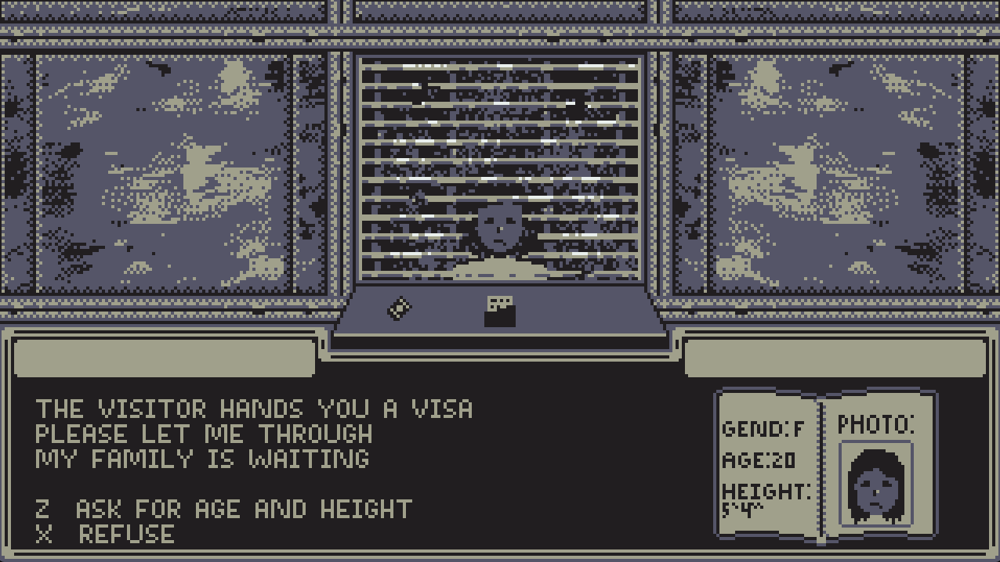

# A Game About Running A Border Checkpoint

Author: Daniel Stankiewicz

Design: There are a few interesting things I did here, first, I wrote a lua script to export fonts from aseprite, and secondly, I tried to use a very limited (gba-like) color palette to make this (https://lospec.com/palette-list/2bit-demichrome).

Text Drawing: Text is shaped and drawn in TextRenderer.cpp and hpp. We initialize and load our pixel font bdf using FreeType, and pack these into a 128x128 texture atlas. We then pass a quad for each glyph to our vertex buffer. Each frame when we call draw_text(), harfbuzz shapes each line into our ids offsets and advances, and we use those to positions our glyph quads, and render. Because we are using pixel art here, we use nearest neighbor for filtering to keep our pixels sharp.

Glyphs are preprocessed at runtime and then text is generated on the fly.

Choices: The choice storage is a bit lackluster here honestly, we store a tree with choices and traverse down it as the user makes their choices.

Screen Shot:

How To Play:

Just use X and Z to pick choices. R resets.

This game was built with [NEST](NEST.md).

